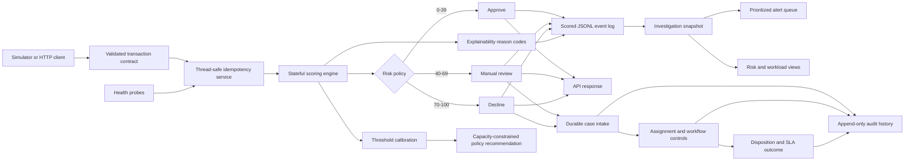

# Architecture

The first vertical slice keeps transport concerns separate from fraud logic. Events enter a
strict domain contract; the stateful scorer maintains only the recent account history required
for velocity, spend, device, location, and merchant checks. A later Kafka-compatible adapter can
replace the simulator without changing the scoring API.

## Decision contract

Every decision contains a bounded 0–100 score, an operational action, and machine-readable reason
codes. This makes outcomes suitable for investigator queues, audit logs, and future dashboards.

## Service boundary

`POST /v1/transactions/score` exposes the decision contract without accepting synthetic fraud
labels. A bounded in-memory idempotency window returns the original decision for exact retries and
rejects transaction IDs reused with different content. A lock makes each state transition atomic
inside one worker. Liveness checks process availability; readiness also reports the active policy
thresholds and number of unique events processed. Multi-worker deployment requires the planned
partitioned transport and durable account-state store so one account's events remain ordered.

## Investigator console

The Streamlit console replays deterministic synthetic events through the production scoring
path, then joins decisions to their source events in a read-only investigation model. Only
`review` and `decline` outcomes enter the risk-sorted queue. Summary cards, signal rankings, and
channel workload are calculated from that same snapshot, preventing disagreement between queue
rows and executive totals. Analysts can filter actions and minimum scores without mutating the
underlying decision order. Synthetic ground-truth labels remain outside the console so the demo
matches the information boundary investigators would have in live operations.

## Case management

Non-approval decisions are converted to cases through the same validated transaction and decision
objects used by the scorer. A unique transaction constraint makes alert intake idempotent, so an
API retry cannot create duplicate investigator work. SQLite transactions serialize each case
mutation and atomically append its audit event.

The workflow explicitly permits only operationally meaningful transitions. Closing requires a
disposition, and closed cases cannot be reassigned or reopened. Priority determines the SLA at
intake (critical: 2 hours, high: 8 hours, standard: 24 hours), while the API computes current or
final SLA state from persisted timestamps. Queue indexes support status, due-time, and risk-based
retrieval; audit events retain actor, timestamp, transition details, and analyst notes.

The default API container persists the database under `/app/data`. A mounted volume makes cases
survive container replacement. SQLite is appropriate for this single-worker portfolio deployment;
a multi-replica service would migrate the repository contract to a networked transactional store.

## Policy calibration

Synthetic labels never enter the scoring path. After each independent score is produced, the
calibrator updates confusion matrices for a fixed grid of candidate thresholds. The recommended
operating point maximizes recall subject to an explicit maximum alert rate and optional precision
floor. The exported candidate table preserves the trade-off curve for governance review instead
of silently changing the live decision thresholds.
