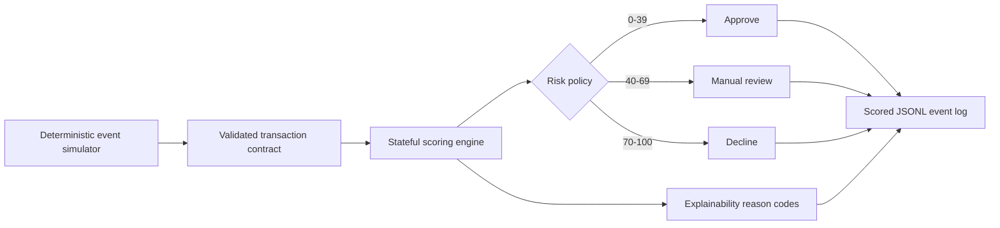

# Architecture

The first vertical slice keeps transport concerns separate from fraud logic. Events enter a
strict domain contract; the stateful scorer maintains only the recent account history required
for velocity, spend, device, location, and merchant checks. A later Kafka-compatible adapter can
replace the simulator without changing the scoring API.

## Decision contract

Every decision contains a bounded 0–100 score, an operational action, and machine-readable reason
codes. This makes outcomes suitable for investigator queues, audit logs, and future dashboards.

